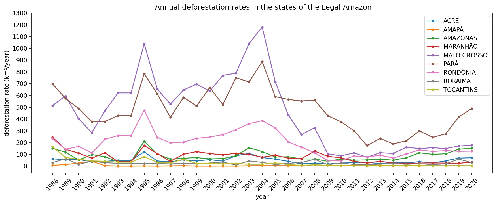
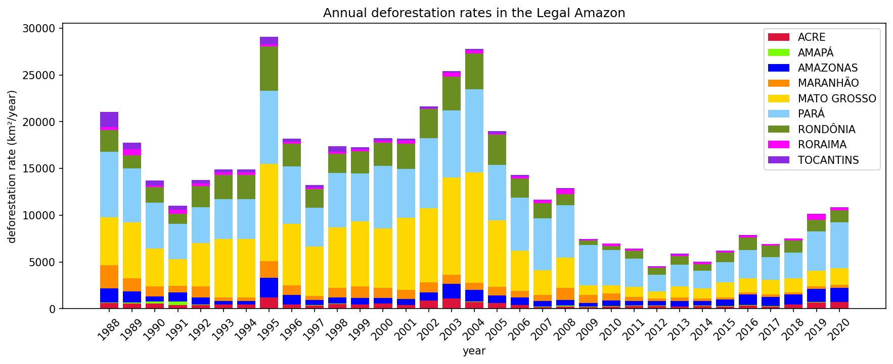

## Legal Amazon historical deforestation and socioeconomic data analysis

  

### Introduction

Amazonia is the richest ecosystem on Earth. Its rainforest covers an area of about 5.5 million km² stretching over nine countries: Brazil, Colombia, Peru, Venezuela, Ecuador, Bolivia, Guyana, Surinam, and French Guyana. About 60% of the Amazon forest lies in Brazil. In this project, I analyzed the historical deforestation data of the Brazilian Amazon, which go from the year 1988 to 2020. The deforestation was investigated in conjunction with other historical data: cattle population, Gross Domestic Product (GDP) per capita and Human Development Index (HDI) of the Legal Amazon. The Brazilian Institute of Geography and Statistics <a href="https://www.ibge.gov.br">(IBGE)</a>  and the Brazilian National Institute of Space Research <a href="http://www.inpe.br">(INPE)</a>  are the sources of the data used in this analysis.  
    
The <a href="https://www.worldbank.org/pt/news/feature/2019/05/22/why-the-amazons-biodiversity-is-critical-for-the-globe">importance</a> of the Amazon forest permeates different levels. At the local level, the Amazon forest provides various resources which are vital for the societies living in its surroundings and interior, such as the various indigenous communities. At the continental level, the Amazon serves as anchor for the rain in South America, generating clouds that go from the north to the south of the continent, contributing to the agricultural production and the thriving of multiple biomes. At the global level, the Amazon is vital for the carbon cycle of the planet; therefore, its deforestation can strongly impact the global climate. In addition, the rich biodiversity in the Amazon forest has been studied, and it shows great potential to be the solution for multiple kinds of diseases.

For its undeniable importance for life on Earth, the preservation of the Amazon forest has been the subject of constant debate, especially in the recent years, due to the <a href="https://amazonia2030.org.br/wp-content/uploads/2021/04/AMZ2030-Fatos-da-Amazonia-20211.pdf">rising rates</a> of deforestation. It remains a challenge for the local societies to develop their economy by using the resources of the Amazon forest while keeping it preserved. Therefore, the purpose of this analysis is to glean insights regarding the correlation between deforestation and socioeconomic growth in the Legal Amazon, in order to help with the development of future, effective practices which will most benefit that region.

### Deforestation in the Legal Amazon

    
The Legal Amazon is a geopolitical definition introduced in 1953 in order to help plan the development of the Brazilian Amazon region, and it is composed by eight states - Acre, Amapá, Amazonas, Mato Grosso, Pará, Rondônia, Roraima and Tocantins - plus a portion of a nineth state - Maranhão. The Legal Amazon encompasses the entire Brazilian Amazon forest, as well as parts of two other biomes called Cerrado and Pantanal. The deforestation data provided by the INPE used in this project refers only to the Amazon forest, and do not account for the other two biomes.
    
The graph below shows the evolution of the deforestation rates in the states of the Legal Amazon from 1988 to 2020. There were peaks in the deforestation curve in the years 1995 and 2004. A substantial decrease in the deforestation rates can be noticed for all states after 2004, but after 2012 the rates started to increase again. The states of Mato Grosso, Pará and Rondônia present the highest deforestation rates in the Legal Amazon.

  

The contribution of each state to the total annual deforestation in the Legal Amazon can be seen in the graph below. Although Mato Grosso is the state with the highest annual deforestation rates between 1988 and 2004, it presented a substantial decrease in the years following 2004. Comparatively, the state of Pará, which is the second with highest annual deforestation rates in the former time interval, seems to have higher inertia regarding changes in the deforestation rates after 2004.

  

From 1988 to 2020, the Brazilian Amazon forest lost a total of 457237 km² of area. The top three states with the biggest portions of deforestation area are Pará (34.42%), Mato Grosso (32.35%) and Rondônia (13.77%). On the other hand, the states with the three lowest deforestation areas are Amapá (0.36%), Roraima (1.88%) and Tocantins (3.45%).

  

### Deforestation and the cattle population

Since it is has been previously brought to attention [1-4] that the meat industry is the main cause of deforestation in the Brazilian Amazon forest, in this section the correlation between deforestation and cattle population will be investigated.
    
As shown in the first graph in the previous section, there was a strong decrease in the deforestation rates in the period between 2004 and 2010. Now, by looking at the graph below, it is possible to notice how that decrease impacted the cattle population in the states of the Legal Amazon during that period, especially the ones with largest cattle population. For those states, namely Mato Grosso, Pará and Rondônia, we see an abrupt deacceleration in the growth of the cattle population between 2004 and 2005, followed by a decrease of the cattle population between 2005 and 2007. After 2007, the cattle started to grow again, but in a weaker rate.

  

Next, the focus will be on the three states with highest cattle population: Mato Grosso, Pará and Rondônia. The deforestation rates will be plotted together with the annual rates for the cattle population growth.

  

  

  

The three graphs above illustrate a possible correlation between the deforestation and the cattle population in the Legal Amazon. In fact, the correlation coeficients for Mato Grosso, Pará and Rondônia, respectively, are 0.51, 0.33 and 0.44. This tells us that as the deforestation rates increase, the rates for the cattle population growth increase accordingly. This is consistent with the fact that for the cattle population to grow, more space is needed not only for the cattle to live, but also for them to feed: either the cattle feed on the grass of deforested areas, or it is fed with rations made of grains which grow in areas that had been deforested.

In the next section, a similar analysis will be performed with the socioeconomic indicators GDP per capita and HDI of the states of the Legal Amazon.

### Deforestation and socioeconomic indicators

Since the HDI in Brazil is calculated every 10 years or so (this interval varies from time to time, it can increase or decrease by a couple of years), I chose to plot the average value of the deforestation area in that same interval. In other words, when I plot the HDI of the year of 2000, I will simultaneously plot the average deforestation area between 1991 and 2000; then, when I plot the HDI of the year 2010, I will also plot the average deforestation area between 2000 and 2010; similarly, for the HDI related to 2017, I will plot the deforestation area between 2010 and 2017. Note that since the deforestation data that goes from 1988 to 2020, when I plot the HDI for 1991, the corresponding average deforestation area will be that of 1988 to 1991. These considerations are illustrated in the graphs below.

The following graphs shows the curves of deforestation plotted against the curves of GDP per capita and HDI. In order to summarize, only three (Mato Grosso, Pará and Rondônia) of the nine states of the Legal Amazon are presented below, but the complete analysis can be found in the notebook 1_Data_Analysis.ipynb .

  

  

  

The three graphs above give an idea of the correlation between deforestation and GDP per capita for those states, which seems to be either negative or almost null. The correlation coeficients of those two features for Mato Grosso, Pará and Rondônia are, respectively: -0.08, -0.27 and -0.30. Then, the economic growth for these states does not benefit in the deforestation of the Amazon, but can even be slightly jeopardized by it.

The deforestation and HDI of these states, as shown in the graphs above, seem to be closely correlated. In fact, the correlation coeficients of deforestation and HDI for Mato Grosso, Pará and Rondônia, are 0.99, 0.99 and 0.91. This means that the variations in the deforestation and in the HDI for those states are strongly correlated, which raises the questions: how can the economy of those states grow while their human development index drop? how can we make the human development benefit from the growth in the economy? An investigation of the distribution of income in those states might help to answer this question.

### Final Remarks

The historical deforestation data of the Legal Amazon were analyzed together with the data of the cattle population, GDP per capita and HDI of that region.

The deforestation rates in the Legal Amazon grew with oscillations from 1988 to 2004. After that, it decreased significantly until 2012, and then it started to increase again with smaller rate. In that region, the states with the biggest areas of deforestation are Pará, Mato Grosso and Rondônia.

The correlation between deforestation and the growth of cattle population is overall *positive*, endorsing what was mentioned in references [1-4] about the meat industry as one of the main causes of the deforestation of the Brazilian Amazon. For states where the deforestation rates are low, the cattle population and the deforested area growths seem to be uncorrelated. On the other hand, the correlation between the deforested area and the cattle population growth is stronger for states with high cattle population and deforestation rates.

For seven of the nine states belonging to the Legal Amazon, the variation in GDP per capita is *negatively* correlated to deforestation rates. On the other hand, the variations in the HDI between 1991 and 2000, 2000 and 2010, 2010 and 2017 seem to be strongly, positively correlated with the mean deforestation rates for those respective periods.

Furthermore, this analysis endorsed the claim that economical growth in the Legal Amazon does not depend on the destruction of the Amazon forest. In fact, for most of the states, it seems to increase as the deforestation rates decrease in time. It remains to answer to the question of how human development can benefit from the economical growth while the deforestation rates drop. Further analysis on other kinds of socioeconomic indicators, such as how the income is distributed and what are the main human an natural resources in each state, is necessary in order to look for effective solutions to this social challenge.

### References

[1] Margulis, S. "Causas do desmatamento na Amazônia brasileira". Brasília, DF: Banco Mundial, 2003. 
[2] Rivero, S.; Almeida, O.; Ávila, S.; Oliveira, W. "Pecuária e desmatamento: uma análise das principais causas diretas do desmatamento na Amazônia". Nova Economia, Belo Horizonte, v. 1, n. 19, p. 41-66, jan./abr. 2009. 
[3] Ladle, R. J.; Machado, A. C. M.; Todd, P. A.; Malhado, A. C. M. "Perceptions of Amazonian deforestation in the British and Brazilian media". Acta Amazonica, Manaus, v. 40, n. 2, p. 319-324, 2010. 
[4] Moloney, A. "Amazon deforestation rose 17% in 'dire' 2020, data shows". Reuters, 2021. 

**Connect with me at <a href="https://www.linkedin.com/in/natalia-tenorio-maia/">LinkedIn</a>**
